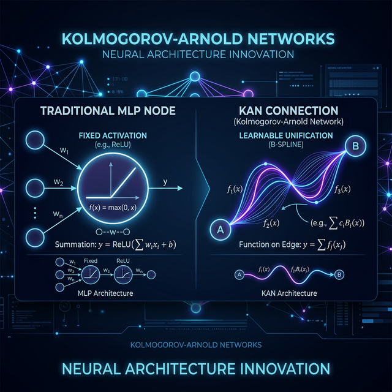
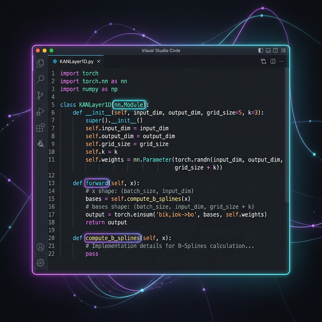
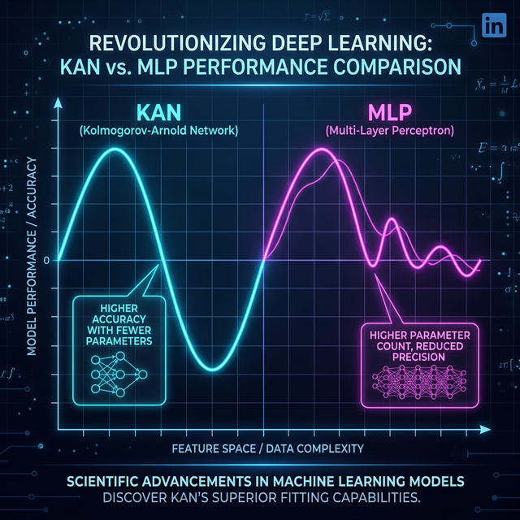

# Deconstructing Kolmogorov-Arnold Networks (KANs) 🧠

*A "Build in Public" mini-series breaking down Kolmogorov-Arnold Networks (KANs) from theory to pure PyTorch implementation.*



## Overview

For decades, we’ve relied on Multi-Layer Perceptrons (MLPs). The recipe is always the same: multiply inputs by weights, sum them up, and pass them through a fixed activation function (like ReLU) located on the node. 

**Kolmogorov-Arnold Networks (KANs)** flip this paradigm. What if the activation function didn't live on the node? What if it lived on the *edge*?

Unlike standard MLPs, KANs have no linear weight matrices and no fixed activation functions. Instead, every single connection between nodes is a learnable, dynamic 1D function (parameterized as a B-spline). 

This repository is part of a "Build in Public" mini-series completely deconstructing KANs.

### Series Outline
1. **Part 1**: The intuition and mathematics (Splines & The Kolmogorov-Arnold Theorem).
2. **Part 2**: Writing a 1D KAN layer in pure PyTorch.
   
3. **Part 3**: Benchmarking KANs vs. MLPs on symbolic regression tasks to prove their parameter efficiency.
   

## Code Structure

### `kan_layer.py` (Part 2)
A minimal, educational 1-Dimensional KAN Layer in pure PyTorch.

**Features:**
- Translates continuous B-Spline mathematics into vectorized tensor operations.
- Implements the Cox-de Boor Algorithm to evaluate basis functions over a grid iteratively.
- Replaces the standard `W*x + b` with a linear combination of B-spline bases.

### `kan_benchmark.py` (Part 3)
A script that empirically benchmarks our custom `KANLayer` against a standard PyTorch `nn.Sequential` MLP on a complex, highly non-linear symbolic regression task.

**Features:**
- Generates a synthetic dataset for the function $y = \sin(3x) + \cos(5x) \cdot \exp(-x^2)$.
- Trains a custom `SimpleKAN` architecture heavily constrained by parameter count against a standard MLP.
- Plots the evaluation to demonstrate KANs' superior ability to learn mathematical curves using far fewer parameters.

## Quick Start

Run the benchmarking script directly to train the models and visualize the results:

```bash
python kan_benchmark.py
```
*(This will generate a `kan_vs_mlp_benchmark.png` plot in your directory comparing the true function, the MLP fit, and the KAN fit).*

## Articles and Posts
The detailed LaTeX write-ups and LinkedIn posts for the series are available locally in this repository. 

Follow along on [LinkedIn](https://www.linkedin.com/feed/update/urn:li:activity:7433288258555559936/?originTrackingId=wbYeW09IWVWVb4umQt1%2FMA%3D%3D) for more architectures built from scratch!
